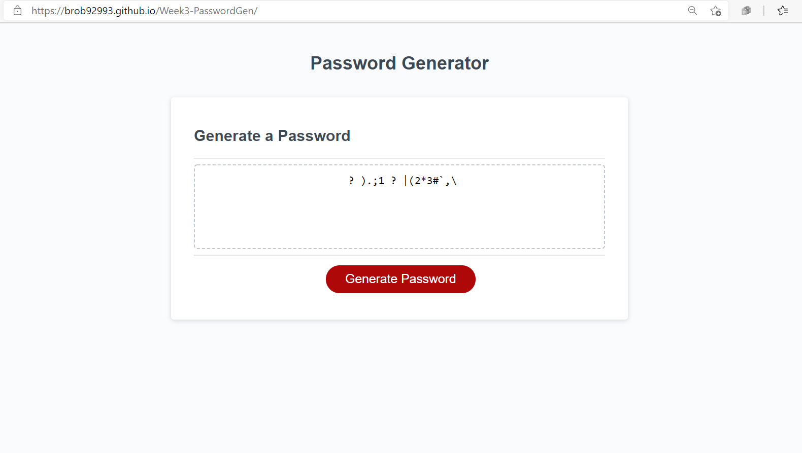

# Week3-PasswordGen

This week's homework was to take starter code for a Random Password Generator and apply the JavaScript methods and logic needed to actually get the generator to work. This password generator will generate a password between 8 and 128 characters, and has the option to include numbers, letters (uppercase & lowercase), and special characters. Below is a link to the application & screenshot of a randomly generated password with 15 characters that includes numbers and special characters.

[Password Generator](https://brob92993.github.io/Week3-PasswordGen/)

